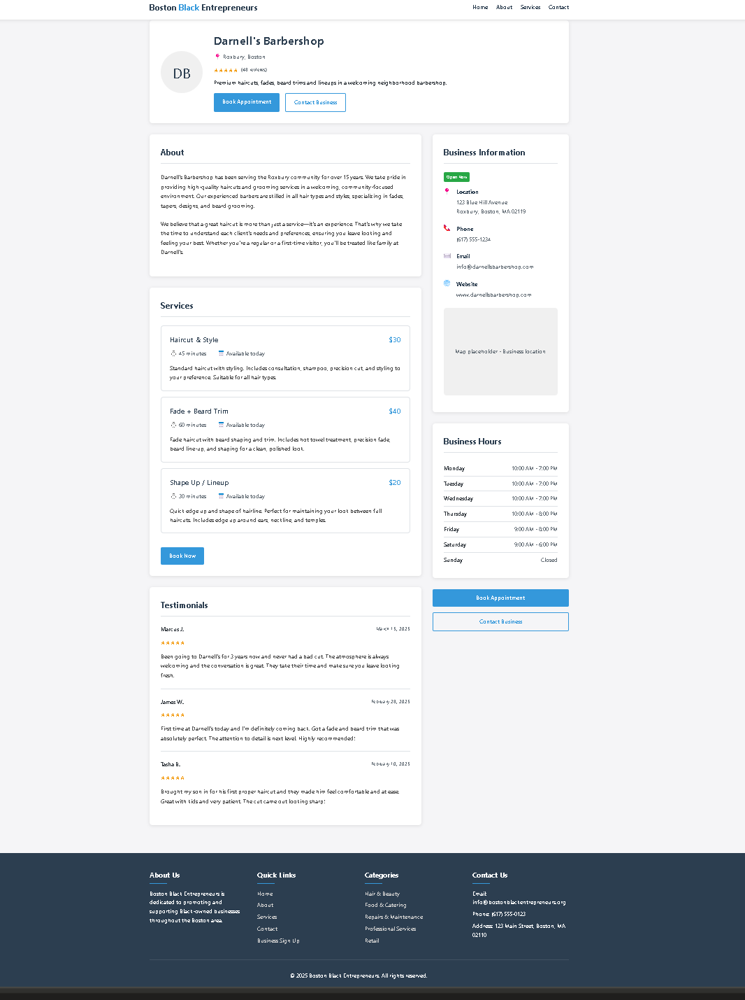
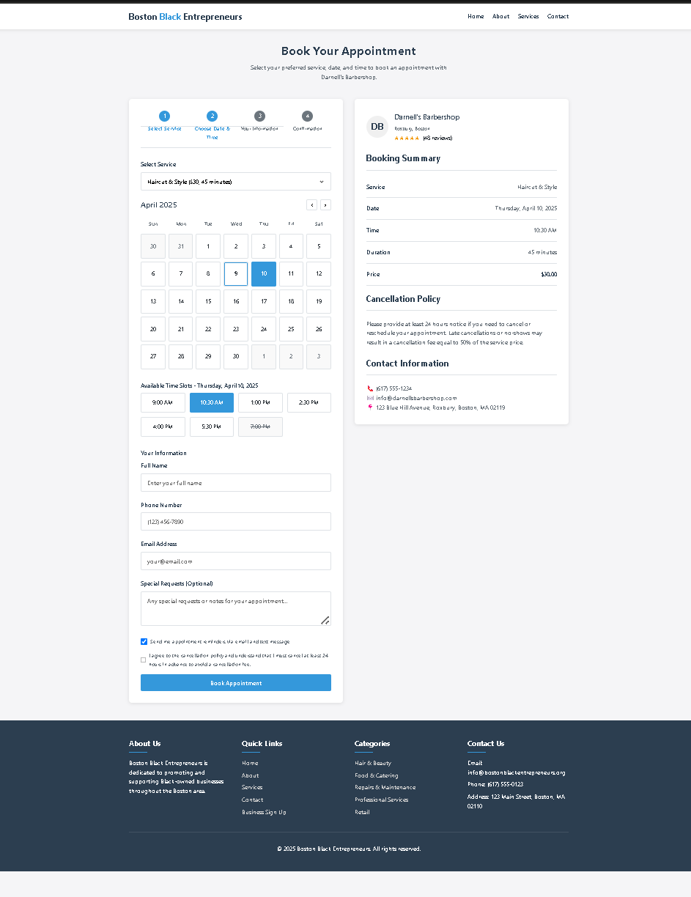
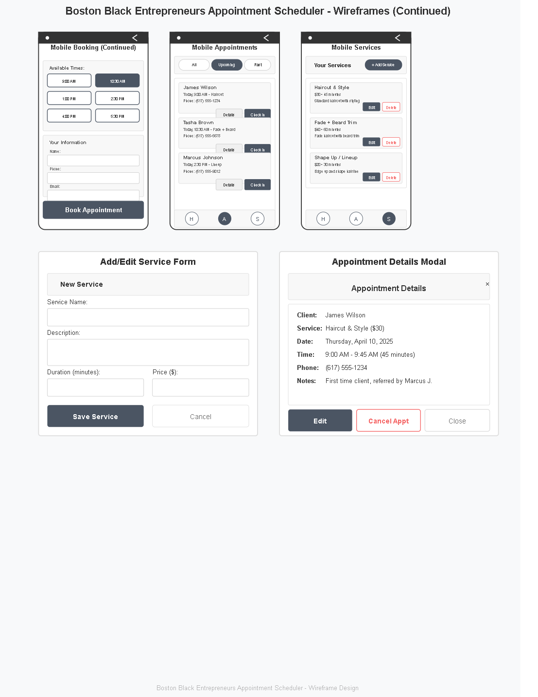

### My Wireframes

1. **Home Page**
   - Header with logo and navigation links (Home, About, Services, Contact)
   - Search bar for finding businesses by service type and location
   - Featured businesses section with images and brief descriptions
   - Call-to-action button for booking an appointment

2. **Business Profile Page**
   - Business logo and name at the top
   - Business details: description, location, contact info
   - Services offered with pricing and duration
   - Business hours section
   - Appointment booking button

3. **Appointment Booking Page**
   - Calendar view for selecting appointment date
   - Time slots available based on business hours
   - Service selection dropdown
   - Client information form (name, phone, email)
   - Confirmation button to book the appointment

1. Business Dashboard
2. Client Booking Page
3. Appointment Management View
4. Service Setup Page 
5. Mobile View Examples
a. Mobile Dashboard
b. Business Mobile Booking page 1

5. Mobile View Examples
c. Mobile Booking Page 2
d. Mobile Appointments
e. Mobile Services
f. Service add/edit Form
g. Appointment Details
